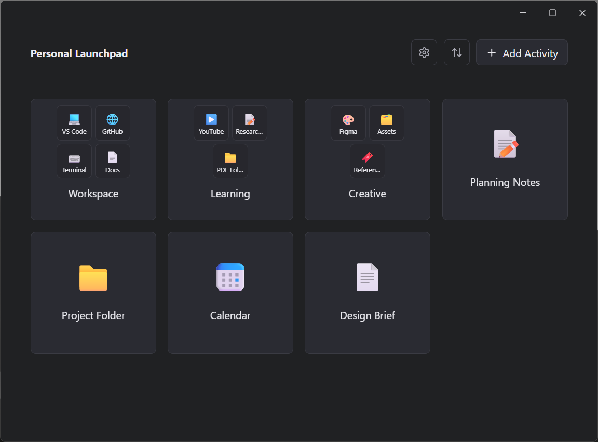
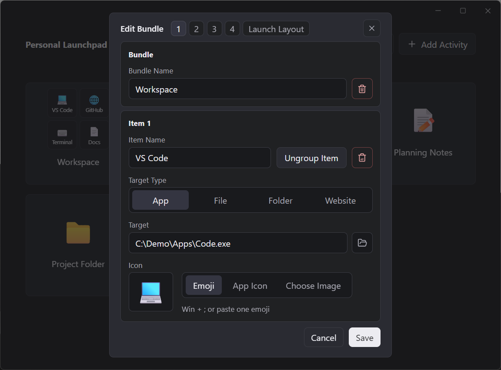
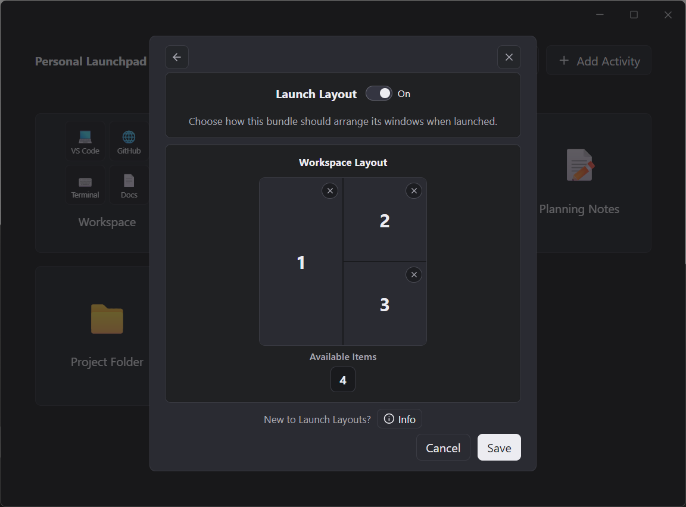
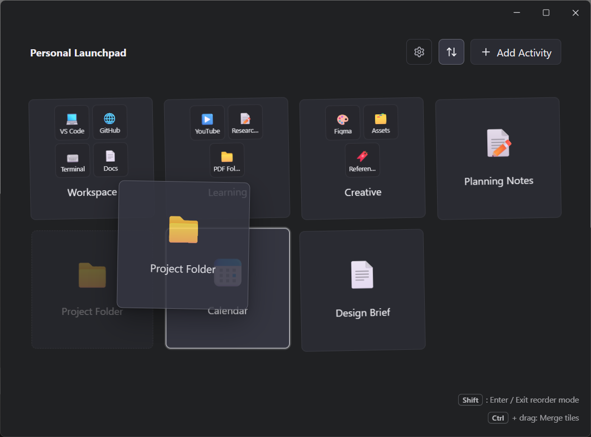
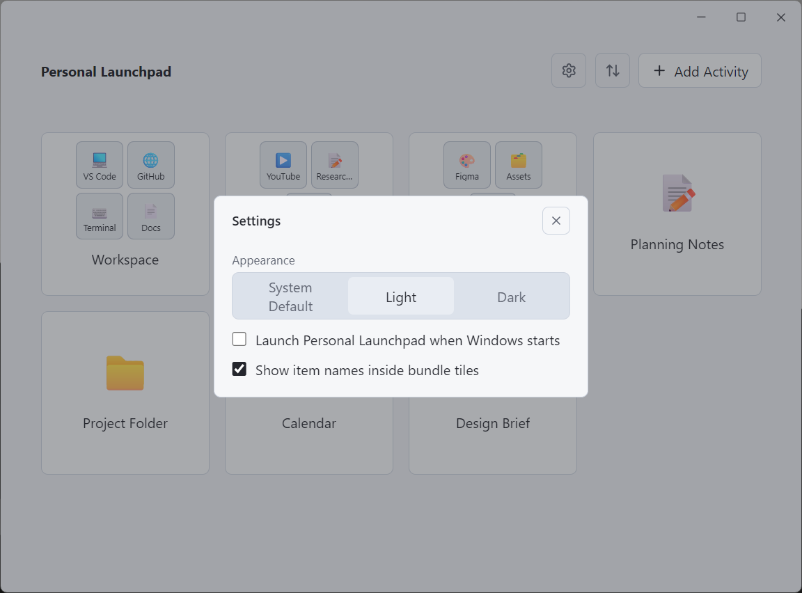

# Personal Launchpad

Personal Launchpad is a calm Windows desktop launcher for the activities you intentionally choose. It keeps apps, files, folders, websites, and small work bundles one click away without turning your desktop into a dashboard.

The app is local-first: your activities, settings, and cached icons stay on your Windows profile under `%APPDATA%/PersonalLaunchpad/`.

## Download

Download the current Windows installer from the [GitHub Releases](https://github.com/MartinMans/personal-launchpad/releases) page.

The current release context is `v1.2.0`. Installer files are attached to GitHub Releases and are not committed to this repository.

## Screenshots

Main launcher in dark theme:

Bundle editing:

Launch Layout editor:

Reorder mode:

Settings in light theme:

## Features

- Launch apps, files, folders, and websites from clean activity tiles.
- Choose App targets from either an executable path or installed Windows apps.
- Group related items into bundles, then launch individual bundle items or the whole bundle.
- Arrange whole-bundle launches with Windows Launch Layouts.
- Use rich icons: emoji, selected image files, website favicons, and extracted app icons.
- Add curated tile colors to visually group activities and bundles.
- Reorder tiles with a focused reorder mode.
- Merge tiles into bundles while reordering, with a temporary undo.
- Edit bundle items, reorder items inside a bundle, and ungroup items back into standalone tiles.
- Choose Dark, Light, or System Default appearance.
- Optionally launch Personal Launchpad when Windows starts.
- Optionally minimize Personal Launchpad to the Windows system tray.
- Keep all user data local.

## Common Workflows

Create an activity:

1. Select `Add Activity`.
2. Choose the target type: app, file, folder, or website.
3. Pick or enter the target. For apps, choose either an executable or an installed app.
4. Choose an icon source and optional tile color.
5. Save the activity.

Create a bundle:

1. Turn on reorder mode.
2. Hold `Ctrl` while dragging one tile onto another.
3. Name the new bundle.
4. Edit the bundle to add, reorder, or ungroup items.

Use Launch Layouts:

1. Edit a bundle.
2. Open `Launch Layout`.
3. Turn the layout on.
4. Place bundle items into the workspace.
5. Launch the whole bundle to open and arrange the selected windows.

Launch Layouts are Windows-only and best-effort. They work best when the target windows are not already open.

## Release Notes

See [CHANGELOG.md](CHANGELOG.md) for release history.

## License

Personal Launchpad is proprietary software.

This public repository provides product information, screenshots, release notes, and links to installer downloads. It does not grant permission to copy, modify, redistribute, reverse engineer, or reuse the application or its assets except as expressly allowed in [LICENSE.md](LICENSE.md).
